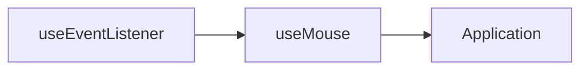

{.w-30.mt--10.mb-5.rounded-full}

---
layout: center
---

<h2>一起探索 VueUse 背後的黑魔法 🪄</h2>

<!--
很開心今天有機會跟大家分享 VueUse，以及底層的一些實作原理
-->

---
src: '../../reuse/intro.md'
---

---
layout: center
---

# 🙋 有聽說過 <span text-hex-42b883 font-bold>VueUse</span> 嗎？

---
layout: center
---

# 🙋 有用過 <span text-hex-42b883 font-bold>VueUse</span> 嗎？

---
layout: center
---

<div class="flex flex-col">
  <h1 important-text-5xl class="leading-tight">
    什麼是<span class="relative inline-block">
      <span text-hex-42b883 font-bold><span v-mark="0">Composables</span></span>
      <div v-click="0" class="relative inline-block">
        <span class="absolute left-[-6em] -top-[3.5em] px-2 py-1 rounded text-2xl bg-[rgba(255,255,255,0.06)]">
          <span text-hex-42b883 font-bold>
            組合式函數
          </span>
        </span>
      </div>
    </span>?
  </h1>
</div>

<!--
那在介紹 VueUse 之前，我想先稍微介紹什麼是 Composables

vue2 mixin
vue3 composables
-->

---

## 來做一個簡單的 `useMouse` 吧！

<div mt4 />

<div class="grid grid-cols-2 gap-x-4">

````md magic-move {at:2}
```vue
<script setup>
import { ref, onMounted, onUnmounted } from 'vue'

const x = ref(0)
const y = ref(0)

function update(event) {
  x.value = event.pageX
  y.value = event.pageY
}

onMounted(() => {
  window.addEventListener('mousemove', update)
})
onUnmounted(() => {
  window.removeEventListener('mousemove', update)
})
</script>

<template>
  <div>Mouse position is at: {{ x }}, {{ y }}</div>
</template>
```

```vue
<script setup>
import { onMounted, onUnmounted, ref } from 'vue'
import { useMouse } from './mouse.ts'

const { x, y } = useMouse()
</script>

<template>
  <div>Mouse position is at: {{ x }}, {{ y }}</div>
</template>
```
````

<v-click>

```ts [useMouse.ts]
import { onMounted, onUnmounted, ref } from 'vue'

export function useMouse() {
  const x = ref(0)
  const y = ref(0)

  function update(event) {
    x.value = event.pageX
    y.value = event.pageY
  }

  onMounted(() => {
    window.addEventListener('mousemove', update)
  })
  onUnmounted(() => {
    window.removeEventListener('mousemove', update)
  })

  return { x, y }
}
```

</v-click>

</div>

---

## 還能再優化嗎？

<div mt4 />

<div class="grid grid-cols-2 gap-x-4">

````md magic-move {at:2}
```ts [useMouse.ts]
import { ref, onMounted, onUnmounted } from 'vue'

export function useMouse() {
  const x = ref(0)
  const y = ref(0)

  function update(event) {
    x.value = event.pageX
    y.value = event.pageY
  }

  onMounted(() => {
    window.addEventListener('mousemove', update)
  })
  onUnmounted(() => {
    window.removeEventListener('mousemove', update)
  })

  return { x, y }
}
```

```ts [useMouse.ts]
import { ref } from 'vue'
import { useEventListener } from './event'

export function useMouse() {
  const x = ref(0)
  const y = ref(0)

  useEventListener(window, 'mousemove', (event) => {
    x.value = event.pageX
    y.value = event.pageY
  })

  return { x, y }
}
```
````

<v-click>

```ts [event.ts]
import { onMounted, onUnmounted } from 'vue'

export function useEventListener(
  target,
  event,
  callback,
) {
  onMounted(() => {
    target.addEventListener(event, callback)
  })
  onUnmounted(() => {
    target.removeEventListener(event, callback)
  })
}
```

</v-click>

</div>

---

## 我們做了什麼

<div mt4 />

<v-clicks>

- 將負責更新滑鼠位置的函數抽離出來 - useMouse
- 將負責綁定事件的函數抽離出來 - useEventListener
- 可以重複使用
- 關注點分離

</v-clicks>

<v-click>

函數關係圖



</v-click>

---
layout: center
---

<div class="grid grid-cols-[3fr_2fr] gap-4">
  <div class="text-center pb-4">
    
    <div class="op-80 mb-2">
      Vue 组合式 API 工具合集
    </div>
    <div class="text-center">
      <a class="!border-none" href="https://www.npmjs.com/package/@vueuse/core" target="__blank"></a>
      <a class="!border-none" href="https://www.npmjs.com/package/@vueuse/core" target="__blank"></a>
      <a class="!border-none" href="https://vueuse.org" target="__blank"></a>
      
      <br>
      <a class="!border-none" href="https://github.com/vueuse/vueuse" target="__blank"></a>
    </div>
  </div>
  <div class="border-l border-gray-400 border-opacity-25 !all:leading-12 !all:list-none my-auto">

  - Tree-shake
  - TypeScript
  - 支援 CDN
  - SSR 支援 (nuxt)
  - 生態系豐富

  </div>
</div>

---
layout: iframe
url: https://vueuse.org
scale: 0.6
---

---
layout: quote
---

# 魔法師都有哪些<span text-hex-42b883 font-bold><span v-mark="0"> 🪄 工具 </span></span>呢？

---

## 🪄 `MaybeRef` 和 `MaybeRefOrGetter`

###### 類型工具

<div mt4 />

<div class="grid grid-cols-[1fr_2fr] gap-4">

<v-clicks>

```ts {all|1-5|7-10|all}
export type MaybeRef<T = any>
  = | T
    | Ref<T>
    | ShallowRef<T>
    | WritableComputedRef<T>

export type MaybeRefOrGetter<T = any>
  = | MaybeRef<T>
    | ComputedRef<T>
    | (() => T)
```

```ts {monaco} {height: '275px'}
/**
 * A ref which will be reset to the default value after some time.
 *
 * @see https://vueuse.org/shared/refAutoReset/#refautoreset
 */
import { refAutoReset } from '@vueuse/core'
import { computed, ref } from 'vue'

const rawMessage = 'default message'
const refMessage = ref(rawMessage)
const comMessage = computed(() => refMessage.value)

refAutoReset(rawMessage, 1000)
refAutoReset(refMessage, 1000)
refAutoReset(comMessage, 1000)
```

</v-clicks>
</div>

<v-clicks absolute left-10 bottom-10>

- 💡 在 `Vue 3.3` 中引入
- PR：https://github.com/vuejs/core/pull/7997

</v-clicks>

---

## 🪄  `toValue`

###### 將響應式資料轉為純值

<div mt4 />

<div flex="~ col gap-y-2">

<v-clicks>

```ts
export function toValue<T>(source: MaybeRefOrGetter<T>): T {
  return isFunction(source) ? source() : unref(source)
}
```

```ts {monaco} {height: '110px'}
import { ref, toValue } from 'vue'

const refValue = ref('123')
const value = toValue(refValue)
```

</v-clicks>
</div>

<v-clicks absolute left-10 bottom-10>

- 💡 在 `Vue 3.3` 中引入
- PR：https://github.com/vuejs/core/pull/7997

</v-clicks>

---

## 🪄  `MaybeElement` 和 `MaybeComputedElementRef`

###### 類型工具

<div mt4 />

<div flex="~ col gap-y-2">
<v-clicks>

```ts
import type { ComponentPublicInstance, MaybeRef, MaybeRefOrGetter } from 'vue'
import { toValue } from 'vue'

export type VueInstance = ComponentPublicInstance
export type MaybeElement = HTMLElement | SVGElement | VueInstance | undefined | null
export type MaybeComputedElementRef<T extends MaybeElement = MaybeElement> = MaybeRefOrGetter<T>
```

```ts {monaco} {height: '115px'}
import { useElementSize } from '@vueuse/core'
import { useTemplateRef } from 'vue'

const el = useTemplateRef<HTMLElement>('el')
const { width, height } = useElementSize(el)
```

</v-clicks>
</div>

<v-clicks absolute left-10 bottom-10>

- Playground：[With Vue Component](https://playground.vueuse.org/?vueuse=13.6.0#eNp9Uk1PwzAM/StRLgUJrUhwgoL40A5wALTtmEvVel1GmkSJuw2q/necdN0HX7fY79l59nPL760drRrgVzzzhZMWmQdsLFO5rm4ERy/4rdCytsYha1njYaygBo1T+QmsY3NnapbcUQuC0sI4SI7pM6ityhEmMN/Rib1nPZrabvOjNARBT3IttNCF0R5ZQblQffOt3UkSkOR04JU55j3pQOLJtppYWdpPSPNQgNtGFDGWlXIVH4y1bd+o6yKQDkgWdTqY01ZCT8FZSkCWHjTiZ7QwEjOX1WjpjaattqG2r5AK3KtFSWIFv2IRCViulFk/xxy6Bs6GfLGA4v2X/NJvQk7wNwce3AoE32GYuwqwh8fTF9jQewfWpmwUsf8BJ+CNaoLGnvbQ6JJkH/Ci2qdondTVzI83CNoPQwWhgdlFvuBkZdjbX6Pv5V6MLmOd0B1tcTiDcJY/jGIePxSQDWtZ4oJKz8/t5noBslrgEMWrDX88JXW8sEMzjz3rvgCUNQLS)

</v-clicks>

---

## 🪄 `unrefElement`

###### 將響應式資料轉為 DOM 元素

<div mt4 />

<div flex="~ col gap-y-2">
<v-clicks>

```ts
export function unrefElement<T extends MaybeElement>(elRef: MaybeComputedElementRef<T>): UnRefElementReturn<T> {
  const plain = toValue(elRef)
  return (plain as VueInstance)?.$el ?? plain
}
```

```ts {monaco} {height: '190px'}
import type { VueInstance } from '@vueuse/core'
import { unrefElement } from '@vueuse/core'
import { useTemplateRef } from 'vue'

const elRef = useTemplateRef<HTMLElement>('el')
const el = unrefElement(elRef)

const elRef2 = useTemplateRef<VueInstance>('el')
const el2 = unrefElement(elRef2)
```

</v-clicks>
</div>

---

## 🪄  `重載`

###### 類型體操 🤓

<div mt4 />

<div flex="~ col gap-y-2">
<v-clicks>

```ts
export function useToggle<Truthy, Falsy, T = Truthy | Falsy>(initialValue: Ref<T>, options?: UseToggleOptions<Truthy, Falsy>): (value?: T) => T
export function useToggle<Truthy = true, Falsy = false, T = Truthy | Falsy>(initialValue?: T, options?: UseToggleOptions<Truthy, Falsy>): [ShallowRef<T>, (value?: T) => T]

export function useToggle(
  initialValue: MaybeRef<boolean> = false,
  options: UseToggleOptions<true, false> = {},
): UseToggleReturn {
  // ...
}
```

不同的參數，會有不同的返回的結果

```ts {monaco} {height: '150px'}
import { useToggle } from '@vueuse/core'

const [isOpen, toggle] = useToggle(false)
```

</v-clicks>
</div>

---
layout: quote
---

# 魔法師都如何運用這些工具製造<span text-hex-42b883 font-bold><span v-mark="0"> ✨ 魔法 </span></span>

---

## ✨ `useEventListener`

###### 萬用的事件綁定函數

<div mt4 />

<v-clicks>

```ts
import { tryOnMounted, tryOnUnmounted } from '@vueuse/core'

export function useEventListener(
  target: EventTarget | null | undefined,
  event: string,
  listener: (event: Event) => void,
) {
  tryOnMounted(() => {
    target.addEventListener(event, callback)
  })
  tryOnUnmounted(() => {
    target.removeEventListener(event, callback)
  })
}
```

<Tip>

使用 tryOnMounted 和 tryOnUnmounted 來避免在元件以外的地方執行時出錯

</Tip>

</v-clicks>

---

## ✨ `tryOnScopeDispose`

###### 安全的 onScopeDispose()

<div mt4 />

<v-clicks>

```ts
import { tryOnUnmounted } from '@vueuse/core'
import { onScopeDispose } from '@vueuse/shared'

export function useEventListener(
  target: EventTarget | null | undefined,
  event: string,
  listener: (event: Event) => void,
) {
  target?.addEventListener(event, callback)

  onScopeDispose(() => {
    target.removeEventListener(event, callback)
  })
}
````

<Info>

RFC: https://github.com/vuejs/rfcs/blob/master/active-rfcs/0041-reactivity-effect-scope.md

</Info>

</v-clicks>

---

## ✨ `watchImmediate`

###### watch 家族的成員之一

<div mt4 />

<div class="grid grid-cols-[1fr_200px] gap-4">

<v-clicks>

````md magic-move
```ts
import { tryOnUnmounted } from '@vueuse/core'
import { onScopeDispose } from '@vueuse/shared'

export function useEventListener(
  target: EventTarget | null | undefined,
  event: string,
  listener: (event: Event) => void,
) {
  target?.addEventListener(event, callback)

  onScopeDispose(() => {
    target.removeEventListener(event, callback)
  })
}
```

```ts
import type { MaybeRefOrGetter } from 'vue'
import { tryOnUnmounted } from '@vueuse/core'
import { onScopeDispose } from '@vueuse/shared'

export function useEventListener(
  target: MaybeRefOrGetter<EventTarget | null | undefined>,
  event: string,
  listener: (event: Event) => void,
) {
  target?.addEventListener(event, callback)

  onScopeDispose(() => {
    target.removeEventListener(event, callback)
  })
}
```

```ts
import type { MaybeRefOrGetter } from 'vue'
import { tryOnUnmounted, unrefElement } from '@vueuse/core'
import { onScopeDispose } from '@vueuse/shared'

export function useEventListener(
  target: MaybeRefOrGetter<EventTarget | null | undefined>,
  event: string,
  listener: (event: Event) => void,
) {
  watchImmediate(
    () => unrefElement(target),
    (newTarget) => {
      newTarget?.addEventListener(event, callback)
    },
  )

  onScopeDispose(() => {
    target.removeEventListener(event, callback)
  })
}
```

```ts
import type { MaybeRefOrGetter } from 'vue'
import { tryOnUnmounted, unrefElement } from '@vueuse/core'
import { onScopeDispose } from '@vueuse/shared'

export function useEventListener(
  target: MaybeRefOrGetter<EventTarget | null | undefined>,
  event: string,
  listener: (event: Event) => void,
) {
  const cleanups: Function[] = []
  const cleanup = () => {
    cleanups.forEach(fn => fn())
    cleanups.length = 0
  }

  watchImmediate(
    () => unrefElement(target),
    (newTarget) => {
      cleanup()
      newTarget?.addEventListener(event, callback)
      cleanups.push(() => newTarget?.removeEventListener(event, callback))
    },
  )

  onScopeDispose(() => {
    target.removeEventListener(event, callback)
  })
}
```
````

</v-clicks>

<v-clicks>

- watchOnce
- watchDeep
- watchWithFilter
- watchTriggerable
- watchPausable
- watchIgnorable

</v-clicks>

</div>

---
layout: quote
---

# <span text-hex-42b883 font-bold><span v-mark="0"> 📖 魔法書 </span></span>還寫了什麼？

---

## 📖 響應式

<div mt4 />

<div grid="~ cols-[1fr_min-content_1fr] gap4">

<v-clicks>

```ts
import { useMouse } from './mouse.ts'

const { x, y } = useMouse()
```

<div i-carbon-arrow-left ma></div>

```ts
const x = ref(0)
const y = ref(0)
return { x, y }
```

</v-clicks>

</div>

<div mt-4 />

<v-clicks>

可以用 reactive 來包裝返回結果

```ts
import { useMouse } from './mouse.ts'

const mouse = reactive(useMouse())
// mouse.x 鏈接到了原來的 x ref
console.log(mouse.x)
```

</v-clicks>

<!--
1. 名字有 `use` 前綴時，代表這是一個組合式函數，所以裡頭會有響應式數據
2. 會返回一個或多個 ref

-->

---

## 📖 響應式

重複使用傳進來的響應式數據，或是轉換成成響應式數據後再返回

<v-clicks>

```ts {monaco} {height: '100px'}
import { ref, shallowRef } from 'vue'

const x = ref(0)
const plusX = ref(x) // 自動解包
```

```ts
const mouse = shallowRef({ x: 0, y: 0 })
const mouse2 = ref(mouse) // ⚠️ 還是淺層
```

如何應用

</v-clicks>

<div grid="~ cols-[1fr_min-content_1fr] gap4">

<v-clicks>

```ts
export function useTitle(newTitle: MaybeRef<string>) {
  const title = ref(newTitle || document.title)

  watchImmediate(title, t => document.title = t)

  return title
}
```

<div i-carbon-arrow-right ma></div>

<div>

```ts
const title = useTitle()
title.value = 'Hello World'
```

```ts
const computedTitle = computed(() => (name.value))
const title = useTitle(computedTitle)
```

</div>

</v-clicks>

</div>

---

## 📖 副作用清理

<div mt4 />

<v-clicks>

- watch
- addEventListener
- Web API
  - MutationObserver
  - IntersectionObserver
  - ResizeObserver

</v-clicks>

---

## 📖 `ShallowRef`

###### 優先使用 shallowRef 而不是 ref

<div mt4 />

<v-clicks>

```ts
export function useFetch<T>(url: MaybeRefOrGetter<string>) {
  // use `shallowRef` to prevent deep reactivity
  const data = shallowRef<T | undefined>()
  const error = shallowRef<Error | undefined>()

  fetch(toValue(url))
    .then(r => r.json())
    .then(r => data.value = r)
    .catch(e => error.value = e)

  /* ... */
}
```

<Tip>

- 多餘的深層響應式會增加不必要的性能開銷

</Tip>

</v-clicks>

---

## 📖 `Readonly`

###### 對於不應該被修改的資料，使用 readonly 來保護

<div mt4 />

<v-clicks>

```ts
const { width, height } = useWindowSize()

width.value = 100 // no warning
height.value = 100 // no warning
```

應該用 `readonly` 包裝後再返回

```ts
import { readonly } from 'vue'

return {
  width: readonly(width),
  height: readonly(height),
}
```

當嘗試修改時，會出現警告

```ts
const { width, height } = useWindowSize()

width.value = 100 // ⚠️ [Vue warn]
height.value = 100 // ⚠️ [Vue warn]
```

</v-clicks>

---

## 📖 `getCurrentInstance`

###### 獲取當前組件實例

<div mt4 />

<v-clicks>

拿到組件實例後，就可以拿到組件的 `el`

```ts
export function useCurrentElement() {
  const vm = getCurrentInstance()!
  return vm?.proxy!.$el
}
```

拿到組件實例後，就可以拿到組件的 `refs`

```ts
export function templateRef(key: string) {
  const vm = getCurrentInstance()
  return vm?.proxy?.$refs[key]
}
```

</v-clicks>

<v-clicks absolute left-10 bottom-10>

- 💡 `getCurrentInstance` 在 `Vue 3+` 中引入
- 💡 `useTemplateRef` 在 `Vue 3.5` 中引入

</v-clicks>

---
layout: quote
---

# 我應該使用這些<span text-hex-42b883 font-bold><span v-mark="0"> 🔮 魔法 </span></span>嗎？

---

## VueUse 能幫助我們解決什麼問題？

<div grid="~ cols-3 gap-3" py4>
  <div v-click flex="~ col gap-1" p4 rounded bg-green:15 text-green12>
    <div text-3xl i-mingcute-empty-box-line text-green mb2 />
    <div>開箱即用</div>
    <div text-xs op50>提供許多現成的組合式函數</div>
  </div>

  <div v-click flex="~ col gap-1" p4 rounded bg-indigo:15 text-indigo12>
    <div text-3xl i-mingcute-eye-line text-indigo mb2 />
    <div>關注點分離</div>
    <div text-xs op50>將業務邏輯抽離</div>
  </div>

  <div v-click flex="~ col gap-1" p4 rounded bg-amber:15 text-amber12>
    <div text-3xl i-mingcute-trending-up-line text-amber mb2 />
    <div>迭代更新</div>
    <div text-xs op50>讓你在各個版本都能使用</div>
  </div>

  <div v-click flex="~ col gap-1" p4 rounded bg-purple:15 text-purple12>
    <div text-3xl i-mingcute-school-line text-purple mb2 />
    <div>最佳實踐</div>
    <div text-xs op50>學習如何撰寫組合式函數</div>
  </div>

  <div v-click flex="~ col gap-1" p4 rounded bg-teal:15 text-teal12>
    <div text-3xl i-mingcute-safety-certificate-line text-teal mb2 />
    <div>安全可靠</div>
    <div text-xs op50>大量的用戶使用，穩定性有保障</div>
  </div>

  <div v-click flex="~ col gap-1" p4 rounded bg-cyan:15 text-cyan12>
    <div text-3xl i-mingcute-world-2-line text-cyan mb2 />
    <div>生態系豐富</div>
    <div text-xs op50>全家桶服務，讓你 @vueuse 打天下</div>
  </div>
</div>

---
layout: center
glow: bottom
---

<div flex="~ col items-center justify-center w-full">
  <h2 flex="~ col" text-center transition duration-300>
    <span
      v-motion
      :initial="{ x: 0, y: 0 }"
      :enter="{ x: 0, y: 0 }"
      :click-1="{ x: 0, y: -25 }"
      flex="~ gap-2 items-center justify-center"
      text-1.5em
    >
      結論
    </span>
  </h2>
</div>

<v-click>

::code-group

```sh [npm]
npm i @vueuse/core
```

```sh [yarn]
yarn add @vueuse/core
```

```sh [pnpm]
pnpm add @vueuse/core
```

::

</v-click>

---

## 參考

- [Vue 官方文件](https://zh-hk.vuejs.org/guide/reusability/composables.html#composables)
- [VueUse 官方文件](https://vueuse.org/guide/best-practice)
- [VueUse 中文文檔](https://vueuse.com/guide/best-practice)
- [可組合的 Vue](https://talks.antfu.me/2021/vueconf-china)
- [VueUse 最佳實踐](https://talks.antfu.me/2022/vueuse-best-practice/)

---
src: '../../reuse/thanks.md'
---

<!--
那我的分享就到這謝謝大家
-->
